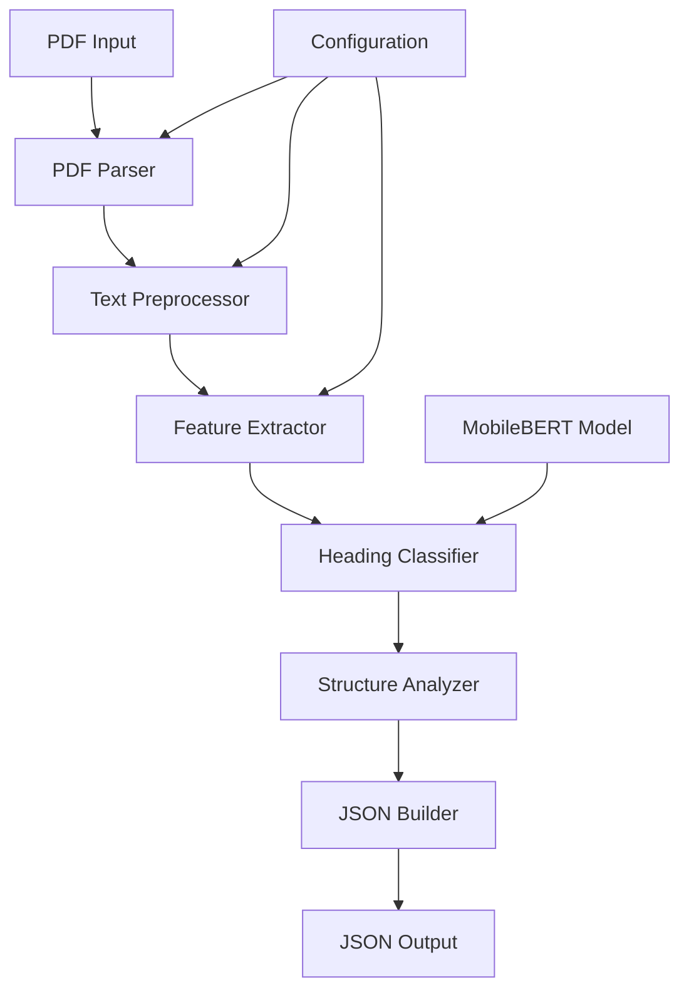

# Design Document

## Overview

The PDF Structure Extractor is a Python-based system that processes PDF documents to extract hierarchical structure information including titles and headings (H1, H2, H3) with their corresponding page numbers. The system combines PyMuPDF for efficient PDF text extraction with a fine-tuned MobileBERT model for intelligent text classification and heading detection.

The architecture follows a pipeline approach: PDF parsing → text preprocessing → feature extraction → ML-based classification → JSON output generation. The system is designed to run in a containerized environment with strict performance constraints (10-second processing time, CPU-only, 200MB model limit).

**Implementation Location**: All code will be implemented within the `problem1a` folder, utilizing the existing project structure with pyproject.toml dependencies (PyMuPDF, torch, transformers) and the local MobileBERT model located in `problem1a/models/local_mobilebert/`.

## Architecture

### High-Level Architecture



### Component Architecture

The system consists of six main components:

1. **PDF Parser**: Extracts raw text and formatting information using PyMuPDF
2. **Text Preprocessor**: Cleans and normalizes extracted text while preserving structure
3. **Feature Extractor**: Generates features for heading classification (font size, position, formatting)
4. **Heading Classifier**: Uses MobileBERT to classify text segments as titles or headings
5. **Structure Analyzer**: Determines hierarchical relationships and heading levels
6. **JSON Builder**: Formats output according to specification

## Components and Interfaces

### PDF Parser Component

**Purpose**: Extract text content and formatting metadata from PDF documents

**Key Classes**:
- `PDFParser`: Main parser class using PyMuPDF
- `TextBlock`: Represents extracted text with formatting information
- `PageInfo`: Contains page-level metadata

**Interface**:
```python
class PDFParser:
    def parse_document(self, pdf_path: str) -> List[TextBlock]
    def extract_page_text(self, page_num: int) -> List[TextBlock]
    def get_document_metadata(self) -> Dict[str, Any]
```

**Implementation Details**:
- Uses `fitz` (PyMuPDF) for PDF processing
- Extracts text blocks with font information, bounding boxes, and formatting
- Handles multilingual text encoding
- Preserves spatial relationships between text elements

### Text Preprocessor Component

**Purpose**: Clean and normalize extracted text while maintaining structural information

**Key Classes**:
- `TextPreprocessor`: Main preprocessing logic
- `TextNormalizer`: Handles text cleaning and normalization
- `StructurePreserver`: Maintains formatting and spatial relationships

**Interface**:
```python
class TextPreprocessor:
    def preprocess_blocks(self, blocks: List[TextBlock]) -> List[ProcessedBlock]
    def normalize_text(self, text: str) -> str
    def preserve_structure(self, blocks: List[TextBlock]) -> List[ProcessedBlock]
```

**Implementation Details**:
- Removes noise while preserving meaningful formatting
- Handles special characters and multilingual content
- Maintains font size, position, and styling information
- Groups related text blocks

### Feature Extractor Component

**Purpose**: Generate features for ML-based heading classification

**Key Classes**:
- `FeatureExtractor`: Main feature extraction logic
- `FontAnalyzer`: Analyzes font characteristics
- `PositionAnalyzer`: Analyzes spatial positioning
- `ContentAnalyzer`: Analyzes text content patterns

**Interface**:
```python
class FeatureExtractor:
    def extract_features(self, block: ProcessedBlock) -> FeatureVector
    def analyze_font_characteristics(self, block: ProcessedBlock) -> FontFeatures
    def analyze_position(self, block: ProcessedBlock) -> PositionFeatures
    def analyze_content(self, block: ProcessedBlock) -> ContentFeatures
```

**Features Generated**:
- Font size relative to document average
- Font weight and style indicators
- Position on page (top, center, left-aligned)
- Text length and word count
- Capitalization patterns
- Punctuation characteristics
- Whitespace patterns

### Heading Classifier Component

**Purpose**: Classify text blocks as titles, headings, or regular text using MobileBERT

**Key Classes**:
- `HeadingClassifier`: Main classification logic
- `MobileBERTAdapter`: Adapts pre-trained model for heading classification
- `ClassificationResult`: Represents classification output

**Interface**:
```python
class HeadingClassifier:
    def classify_block(self, features: FeatureVector, text: str) -> ClassificationResult
    def load_model(self, model_path: str) -> None
    def predict_heading_level(self, block: ProcessedBlock) -> HeadingLevel
```

**Implementation Details**:
- Adapts MobileBERT for sequence classification
- Combines textual features with formatting features
- Uses fine-tuning approach for heading detection
- Handles multilingual text classification
- Outputs confidence scores for each classification

### Structure Analyzer Component

**Purpose**: Determine hierarchical relationships and organize headings into proper structure

**Key Classes**:
- `StructureAnalyzer`: Main structure analysis logic
- `HierarchyBuilder`: Builds heading hierarchy
- `TitleDetector`: Identifies document title

**Interface**:
```python
class StructureAnalyzer:
    def analyze_structure(self, classified_blocks: List[ClassificationResult]) -> DocumentStructure
    def build_hierarchy(self, headings: List[Heading]) -> List[Heading]
    def detect_title(self, blocks: List[ClassificationResult]) -> Optional[str]
```

**Implementation Details**:
- Determines heading levels (H1, H2, H3) based on classification and context
- Builds hierarchical relationships between headings
- Identifies document title using multiple heuristics
- Handles edge cases like missing levels or inconsistent formatting

### JSON Builder Component

**Purpose**: Format extracted structure into required JSON output format

**Key Classes**:
- `JSONBuilder`: Main JSON formatting logic
- `OutputValidator`: Validates output format
- `ErrorHandler`: Handles error cases

**Interface**:
```python
class JSONBuilder:
    def build_json(self, structure: DocumentStructure) -> Dict[str, Any]
    def validate_output(self, json_data: Dict[str, Any]) -> bool
    def handle_errors(self, error: Exception) -> Dict[str, Any]
```

**Output Format**:
```json
{
  "title": "Document Title",
  "outline": [
    {"level": "H1", "text": "Heading Text", "page": 1},
    {"level": "H2", "text": "Subheading Text", "page": 2}
  ]
}
```

## Data Models

### Core Data Models

```python
@dataclass
class TextBlock:
    text: str
    page_number: int
    bbox: Tuple[float, float, float, float]
    font_size: float
    font_name: str
    font_flags: int
    
@dataclass
class ProcessedBlock:
    text: str
    page_number: int
    features: FeatureVector
    original_block: TextBlock
    
@dataclass
class FeatureVector:
    font_size_ratio: float
    is_bold: bool
    is_italic: bool
    position_x: float
    position_y: float
    text_length: int
    capitalization_score: float
    whitespace_ratio: float
    
@dataclass
class ClassificationResult:
    block: ProcessedBlock
    predicted_class: str  # 'title', 'h1', 'h2', 'h3', 'text'
    confidence: float
    
@dataclass
class Heading:
    level: str
    text: str
    page: int
    confidence: float
    
@dataclass
class DocumentStructure:
    title: Optional[str]
    headings: List[Heading]
    metadata: Dict[str, Any]
```

## Error Handling

### Error Categories

1. **PDF Processing Errors**
   - Corrupted or unreadable PDF files
   - Password-protected documents
   - Unsupported PDF versions

2. **Model Loading Errors**
   - Missing model files
   - Incompatible model versions
   - Memory allocation failures

3. **Classification Errors**
   - Low confidence predictions
   - Ambiguous text classification
   - Model inference failures

4. **Output Generation Errors**
   - JSON serialization issues
   - File system write errors
   - Invalid output format

### Error Handling Strategy

```python
class ErrorHandler:
    def handle_pdf_error(self, error: PDFError) -> Dict[str, Any]:
        return {
            "title": "Error: Unable to process PDF",
            "outline": [],
            "error": str(error)
        }
    
    def handle_model_error(self, error: ModelError) -> Dict[str, Any]:
        # Fallback to rule-based classification
        return self.fallback_classification()
    
    def handle_timeout_error(self) -> Dict[str, Any]:
        return {
            "title": "Error: Processing timeout",
            "outline": [],
            "error": "Processing exceeded 10 second limit"
        }
```

## Testing Strategy

### Unit Testing

1. **PDF Parser Tests**
   - Test with various PDF formats and structures
   - Verify text extraction accuracy
   - Test multilingual document handling

2. **Feature Extractor Tests**
   - Validate feature generation for different text types
   - Test edge cases with unusual formatting
   - Verify feature normalization

3. **Classifier Tests**
   - Test heading classification accuracy
   - Validate confidence score ranges
   - Test multilingual classification

4. **Structure Analyzer Tests**
   - Test hierarchy building logic
   - Validate title detection algorithms
   - Test edge cases with missing levels

### Integration Testing

1. **End-to-End Pipeline Tests**
   - Test complete processing pipeline
   - Validate JSON output format
   - Test performance within time constraints

2. **Docker Container Tests**
   - Test containerized execution
   - Validate volume mounting
   - Test network isolation

### Performance Testing

1. **Speed Tests**
   - Measure processing time for various document sizes
   - Profile memory usage
   - Test CPU utilization

2. **Accuracy Tests**
   - Evaluate heading detection accuracy
   - Test multilingual performance
   - Validate against ground truth data

### Test Data

- Use provided sample PDFs: `E0CCG5S239.pdf`, `TOPJUMP-PARTY-INVITATION-20161003-V01.pdf`
- Create synthetic test cases for edge scenarios
- Include multilingual test documents
- Generate performance benchmark documents